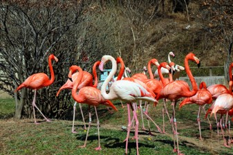
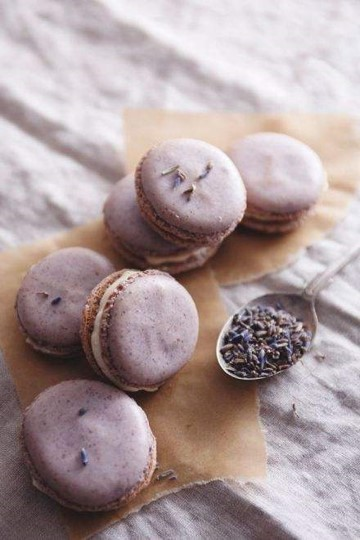

# Multi-Modal Full-Parameter Fine-Tuning

## Two-Stage Training of Multi-Modal LLaMA2

For multi-modal fine-tuning, we follow a two-stage paradigm

### Stage1

In stage one, we train the model on large scale image-text pairs

**Script:**

+ The code for the first stage will be released soon.

**Data:**

+ COYO/LAION/CC3M/CC12M/SBU

**Model Release:**

+ [Stage One Checkpoint](https://huggingface.co/Alpha-VLLM/LLaMA2-Accessory/tree/main/finetune/mm/caption_llamaQformerv2_13b/)

### Stage2

In stage two, we further tune the model on multi-modal instruction-following data

**Script:**

+ [exps/finetune/mm/alpacaLlava_llamaQformerv2_13B.sh](../accessory/exps/finetune/mm/alpacaLlava_llamaQformerv2_13B.sh)
  + The `--pretrained_path` argument should point to checkpoints saved by stage one instead of original LLaMA

**Data:**

+ https://github.com/Instruction-Tuning-with-GPT-4/GPT-4-LLM/blob/main/data/alpaca_gpt4_data.json
+ https://huggingface.co/datasets/liuhaotian/LLaVA-Instruct-150K/blob/main/llava_instruct_150k.json
  + Note that before training, we have converted LLaVA into the single-turn form with [this script](../accessory/tools/llava_to_single_turn.py)

**Model Release:**

+ [Stage Two Checkpoint](https://huggingface.co/Alpha-VLLM/LLaMA2-Accessory/tree/main/finetune/mm/alpacaLlava_llamaQformerv2_13b/)

**Host Local Demo:**

```bash
torchrun --nproc-per-node=2  demos/single_turn_mm.py \
--llama_config /path/to/params.json --tokenizer_path /path/to/tokenizer.model \
--pretrained_path /path/to/multimodel_llama
```
**Example:**

> **Stage One**
>
> *Without prefix prompt*
>
> 
>
> *Answer*: A group of flamingos standing on top of a lush green field.
>
> *With prefix prompt*
>
> 
>
> prefix prompt: 'The author'
>
> *Answer*: The author of this painting is Vincent Van Gogh.
>
> **Stage Two**
>
> 
>
> *Instruction:*
>
> What is the food in the picture? Provide recipes for making the food in the picture.
>
> *Answer:*
>
> The food in the picture is a set of macaroons, which is a type of small, round, and crispy pastry. Macaroons are typically made with ingredients such as almond flour, butter, sugar, and egg whites. There are several recipes available online for making these delicious treats, such as the following:
>
> **Almond-covered Macaroons:**
>
> **Ingredients:**
>
> - 1 cup of almond flour
> - 1/2 cup of granulated sugar
> - 1/4 cup of unsalted butter, melted
> - 1 teaspoon of vanilla extract
> - a few drops of food coloring (optional)
>
> **Instructions:**
>
> 1. Preheat your oven to 350°F (175°C). Line a baking sheet with parchment paper.
> 2. In a large mixing bowl, mix together the almond flour, granulated sugar, and melted butter. Add the vanilla extract and mix well.
> 3. Add a few drops of food coloring, if using, and mix again.
> 4. Scoop small portions of the mixture and place them on the prepared baking sheet, ensuring enough space between each macaroon.
>
> [*More examples here*](./examples/finetune/mm/alpacaLlava_llamaQformerv2_13b.md)

---

*More use cases coming soon...*
